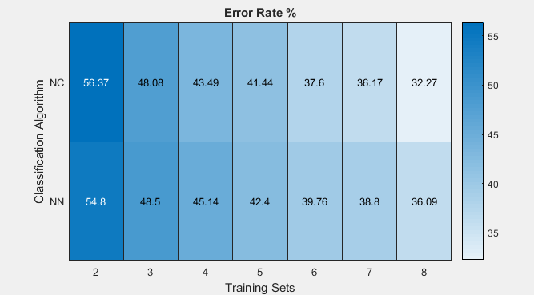

# Eigenfaces PCA & Face Recognition

This matlab code takes the famous Yale grayscale face dataset, creates eigenfaces and classifies each subset with nearest centroid classifier and also with nearest neigbor classifier.

And also script checks the classification performance using the supplied right classification of the faces and gives an output of heatmap table with the error rates of each training subset/classifier.

## Output

## Running

- Run the `main.m` file.
- **IMPORTANT:** Please wait for the calculation to end, it might take about a munite depending on computer processing power.

- Make sure script is working in the same folder with datasets.

## Links
- Mostly followed this tutorial while implementing eigenfaces https://cnx.org/contents/m0ECB7MO@3/Obtaining-the-Eigenface-Basis
- For PCA, I read this http://www.cs.otago.ac.nz/cosc453/student_tutorials/principal_components.pdf
- Dataset http://www.cad.zju.edu.cn/home/dengcai/Data/FaceData.html (Also included in this git repo)
- Heatmap chart https://www.mathworks.com/help/matlab/ref/heatmap.html
